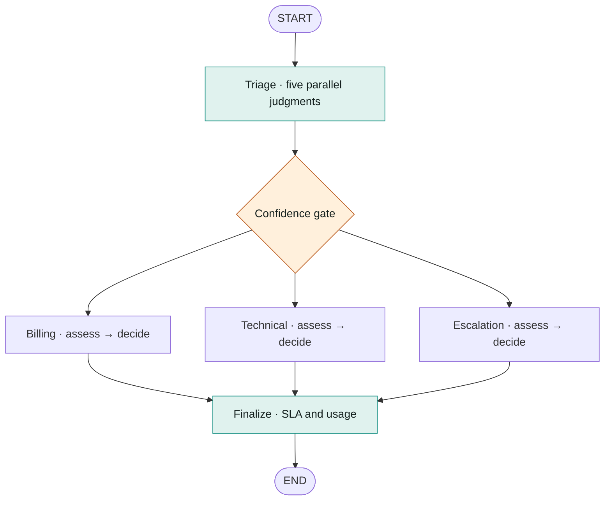

<div align="center">

# Confidence Gate

**Can a model’s confidence tell you when to trust it?**

A support-triage benchmark comparing TypeSafe Jev and OpenAI on the same LangGraph workflow.


[Quick start](#quick-start) · [Results](#what-this-experiment-tests) · [Architecture](#the-graph) · [HTML report](docs/index.html) · [Project layout](#layout)

</div>

---

## At a glance

One graph, one policy, two judgment engines. This experiment tests TypeSafe’s
published claims about Jev in a support-triage workflow, with a confidence gate
that sends uncertain cases to a human.

| Observed in this run | Jev | OpenAI (`gpt-4o-mini`) |
| :--- | ---: | ---: |
| Time to routing decision | **163 ms** | 1,164 ms |
| Department accuracy | **87.5%** | 75.0% |
| Cost per 1,000 tickets | **$0.06** | $0.37 |
| Routing errors caught by the gate | 0 of 3 | 0 of 6 |

> [!IMPORTANT]
> These results come from **24 invented tickets**. Jev was faster and cheaper in
> this run, but the sample is too small to establish calibration. Its confidence
> gate caught none of its three routing errors. [Read the caveats](#caveats).

To view the HTML report locally, run `uv run python -m http.server 8000` from the
repository root and open [localhost:8000/docs/](http://localhost:8000/docs/).

## Why this experiment

TypeSafe launched Jev as a "System One Model": a frontier-intelligence function
call, unstructured state in and typed probabilistic decisions out, claiming two
orders of magnitude more speed and efficiency than an LLM on decision-shaped
work, and — the claim this repo cares about most — decisions that arrive with
*calibrated* probabilities, where higher confidence really does mean higher
accuracy.

That last claim is the interesting one, because it is the one that would change
how you build. If a model reliably knows when it does not know, you can hand its
uncertain cases to a human and automate the rest. If it does not, you cannot,
however accurate it is on average.

So this is a multi-agent support-triage system on LangGraph subgraphs with the
judgment layer behind a swappable interface, and a `gate` node whose only job is
to act on a confidence number. The graph, the policy, the thresholds and the
money rules are identical across engines; the only thing that changes between
runs is where the probabilities came from. Then we measure which of TypeSafe's
claims survive contact with it.

**Short version:** the speed and cost claims hold. The intelligence-parity claim
holds. The calibration claim — the one that matters most — is not demonstrated
here, and this workload does not have the statistical power to test it properly.
[Jump to the claims table.](#what-this-experiment-tests)

## Quick start

### 1. Install dependencies

Requires **Python 3.11+** and **uv**.

```bash
uv sync --extra dev
```

### 2. Configure API keys

Copy `.env.example` to `.env`, then set both keys:

```bash
cp .env.example .env
```

```dotenv
TYPESAFE_API_KEY='apikey_...'
OPENAI_API_KEY='sk-...'
```

A bare TypeSafe key on its own line (no `NAME=`) is also accepted, since that is
how the console hands it out.

Optional overrides: `TYPESAFE_DEFAULT_MODEL` (default `jev-latest`),
`OPENAI_MODEL` (default `gpt-4o-mini`).

### 3. Run the benchmark

```bash
# compare both engines over the labeled set
uv run agentbench bench --out results/run.json

# one ticket, with the full decision trace
uv run agentbench run T-013 --engine jev

# no keys needed: a keyword-heuristic engine that exercises the graph
uv run agentbench run T-013 --engine fake

# print the topology, subgraphs expanded
uv run agentbench graph

uv run pytest
```

## The graph



The confidence gate is ordinary code. Each department is a compiled subgraph
with two steps, `assess → decide`: `assess` asks the engine for judgments,
`decide` turns them into an action with plain code.

### Where the model stops and code starts

This is the design the project is actually testing. The model is never asked
what to *do* — only to describe the situation:

| Judgment (model) | Decision (code) |
| --- | --- |
| `department` + its probabilities | which subgraph runs, and whether confidence is high enough to trust it at all |
| `priority` as a 0–3 expected score | the SLA clock |
| `needs_human` as a probability | the escalation threshold |
| `action: full_refund` + `policy_exception` | the refund amount, and whether a supervisor must approve it |
| `severity`, `data_loss_risk` | whether to page on-call |
| `tier`, `legal_exposure` | the legal override, which no weighted score can average away |

Two consequences worth noticing. Changing the refund approval limit does not
re-run inference — the judgments are unchanged, only the policy reading them.
And an uncertain department choice is not resolved by guessing; it routes to a
human. That is the `gate` node, and it only works if the confidence number means
something, which is what the benchmark measures.

### Speculative questions

`refund_eligible` is asked during triage even though it only matters on the
billing branch. It rides along in the same parallel request, which costs one
extra question instead of a second round trip. Code consumes it only where it
applies and ignores it everywhere else.

## What the benchmark reports

Accuracy is the headline and the least interesting column:

- **department accuracy** — did it pick the right team
- **priority MAE** — error on the 0–3 urgency score
- **needs_human accuracy** — at the policy threshold, not the model's opinion
- **calibration error** — bin by stated confidence, compare against how often
  that bin was actually right; 0 means the numbers mean what they say
- **confidence separation** — mean confidence when right minus when wrong. Near
  zero means confidence carries no signal and the gate cannot work, whatever
  the accuracy column says
- **abstention rate** / **errors caught by gate** — how many of its own mistakes
  the system handed to a human instead of acting on

Timing is captured at three points, because "latency" alone hides where the
time goes:

- **time to decision** — wall clock from the ticket entering the graph to the
  `gate` node choosing a branch. This is the number an SLA starts on: the point
  where the ticket has somewhere to go.
- **end-to-end** (mean, p50, p95) — wall clock around the whole invocation,
  including the department subgraph's own engine call.
- **of which engine / of which graph** — end-to-end split into time spent
  waiting on the judgment layer versus time spent in LangGraph itself. The
  second number should stay small; if it does not, the comparison is measuring
  the harness rather than the engines.

Cost is reported as input/output tokens, the dollar cost of the run, and dollars
per 1,000 tickets. Prices are hand-entered list prices in `pricing.py` and go
stale — check them before quoting a figure.

Then: how often the engines agree, and a table of every ticket where they differ
with who was right.

A routing layer that is wrong 10% of the time and knows which 10% is worth more
than one that is wrong 5% of the time with uniform swagger. The first can route
its uncertain cases to a person; the second cannot.

## What this experiment tests

Every row below is a claim TypeSafe published. The verdict column is what this
repo's 24-ticket workload can actually say about it — which for two of the rows
is "less than you'd like."

| TypeSafe's claim | Tested here? | Verdict |
| --- | --- | --- |
| End-to-end response 70–500 ms | Directly | **Holds.** 163 ms to a routing decision, 316 ms mean end to end, 430 ms p95 — inside the claimed band, over the public internet from a laptop. |
| 40–200× faster than LLMs | Partially | **Not at that magnitude — but against the hardest possible comparator.** 7.1× vs `gpt-4o-mini`. Their figure is against frontier reasoning models; a small non-reasoning model is the least flattering baseline you could pick. |
| $0.042/MTok in, output free | Directly | **Holds as priced.** 6.1× cheaper per ticket. See the wrinkle below. |
| Type-safe, cannot hallucinate | Weakly | **No counter-example in 48 calls.** But OpenAI's strict JSON mode also produced zero type errors, so this workload cannot separate *guaranteed* from *reliable in practice*. |
| Similar intelligence on System One tasks | Directly | **Holds.** 0.875 vs 0.750 on departments — same ballpark, Jev ahead, margin of 3 tickets. |
| Consistent: similar answers for similar inputs | Incidentally | **Supported.** Across two full runs Jev picked the same department on all 24 tickets, with confidences moving only in the second decimal. |
| **Calibrated: higher confidence → higher accuracy** | **This was the point** | **Not demonstrated.** Confidence separation −0.010; the gate caught 0 of 3 errors. With 3 errors to work from, this is *untested at adequate power*, not refuted. |

### The run

24 tickets, `jev-latest` vs `gpt-4o-mini`, two requests per ticket each, same
questions, same graph, same policy.

| | jev | openai |
| --- | --- | --- |
| department accuracy ↑ | **0.875** | 0.750 |
| priority MAE ↓ | **0.549** | 0.646 |
| needs_human accuracy ↑ | 0.583 | **0.750** |
| calibration error ↓ | 0.199 | 0.150 |
| confidence separation ↑ | −0.010 | −0.000 |
| abstention rate | 0.083 | 0.000 |
| errors caught by gate ↑ | 0.000 | 0.000 |
| time to decision ↓ | **163 ms** | 1164 ms |
| end-to-end p95 ↓ | **430 ms** | 2996 ms |
| of which graph | 3.7 ms | 3.6 ms |
| input tokens ↓ | **34,226** | 40,750 |
| output tokens | 4,573 | 4,487 |
| cost / 1k tickets ↓ | **$0.06** | $0.37 |

The ~4 ms of graph overhead on both sides is what makes the rest of the table
worth reading: the harness is not what is being measured.

### The speed claim holds, for the reason they say

163 ms to a decision, 7.1× faster than a small non-reasoning LLM asked exactly
the same questions with exactly the same rubrics. Both engines make two requests
per ticket. The difference is what comes back: a System One model emits its
answer in one parallel pass, where prompt-and-parse has to write a JSON object
out token by token.

### The cost claim holds, but not how you'd guess

6.1× cheaper per ticket — and worth understanding, because the naive reading is
wrong. **Jev's output token count was not smaller**: 4,573 against 4,487,
essentially identical. The saving comes from the price sheet, not the volume —
output billed at zero, and input at $0.042/MTok against $0.15. If you were
expecting parallel sampling to show up as fewer output tokens, it doesn't. It
shows up on the invoice.

### The calibration claim is the one that didn't land

This is the result most worth not overselling, and the reason the repo is named
after the gate rather than the model.

Put two rows beside each other. Jev got 3 tickets wrong. It abstained on 2. They
were *different* tickets — `errors caught by gate: 0.000`. It gated answers it
had actually gotten right, and its real errors went through with high
confidence. Confidence separation of −0.010 says it plainly: on this set the
number was very slightly *anti*-correlated with being right.

Two honest qualifications, in both directions:

- **This does not refute the claim.** Three errors is not a sample. A calibration
  measurement driven by 3 data points has essentially no power, and both ECE and
  confidence separation need hundreds of cases to be stable. The correct reading
  is "this workload could not test it," not "the claim is false."
- **It also isn't nothing.** The gate is the thing you would actually build on a
  calibration guarantee, and on this workload it did not work. That is worth
  knowing before designing around it.

Do not credit the calibration error column to either engine, either. It
nominally favours `gpt-4o-mini` (0.150 vs 0.199), but a predictor that always
answers 0.9 scores well on ECE whenever 0.9 sits near its overall accuracy,
which is roughly what happened. Confidence separation catches that, and at
−0.000 it says the number carried no information about correctness at all.

What *is* true, narrowly: Jev's confidence **varies** — 0.32, 0.42, 0.55 on
genuinely ambiguous tickets — where `gpt-4o-mini` reported 0.9 on nearly
everything. A varying signal is a precondition for a gate to do anything; a
pinned one makes it dead code at any threshold. Varying is not the same as
useful.

### Where they disagreed

On all three tickets where the engines diverged, Jev was right, and each time
reported low confidence while the other reported 0.9.

| ticket | labelled | jev | openai |
| --- | --- | --- | --- |
| T-014 "your app lost my work" | technical | technical @ 0.42 | billing @ 0.90 |
| T-017 "third time asking" | escalation | escalation @ 0.55 | billing @ 0.90 |
| T-024 "account compromised?" | escalation | escalation @ 0.32 | technical @ 0.90 |

### What would settle the open question

The calibration claim needs a workload where the error count is large enough to
measure against — a few hundred real tickets, not 24 invented ones. Until then
the speed and cost claims are the ones this repo can vouch for.

## Caveats

The 24 tickets are invented and the labels are one reviewer's judgment, about a
third of them on deliberately ambiguous cases. That is enough to smoke-test the
harness and see where two engines diverge; it is **not** enough to conclude
anything about either model, and the run above says so in more detail. Swap in
your own traffic before reading anything into a number here.

Every accuracy-style metric on 24 cases moves in steps of 4 percentage points,
so a one-ticket difference looks like a margin. The confidence metrics are worse
than that: they are driven by however many tickets the engine got wrong, which
here was three. Running the suite twice bears this out — Jev's department choices
were identical across both runs, but `needs_human` accuracy moved 0.667 → 0.583
and the abstention rate 0.125 → 0.083, purely from probabilities drifting across
a fixed threshold.

The comparator matters as much as the sample. `gpt-4o-mini` is a small,
non-reasoning model, which makes it a demanding baseline for a speed claim and a
generous one for an accuracy claim. TypeSafe's own 40–200× figures are measured
against frontier reasoning models; do not read 7.1× here as contradicting them.

The thresholds in `graph/policy.py` are starting points, not validated defaults.
Tune them against your own data and your own consequences.

## Layout

```text
docs/
  index.html            visual benchmark report
src/agentbench/
  types.py              domain types, normalized judgment shapes
  config.py             .env loading
  bench.py              sweep + metrics
  cli.py                run / bench / graph
  engines/
    questions.py        the questions, defined once, engine-neutral
    base.py             the DecisionEngine protocol
    jev.py              TypeSafe System One
    openai_engine.py    strict JSON schema
    fake.py             offline heuristic, no key needed
  graph/
    state.py            shared state schema
    policy.py           thresholds, SLAs, money rules — no model calls
    supervisor.py       parent graph
    subgraphs/          billing, technical, escalation
  data/tickets.py       24 labeled tickets
tests/
```

Adding a third engine means implementing one method, `ask(state, questions)`,
and registering it in `engines/__init__.py`.
